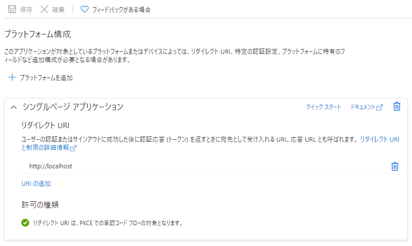

# Adding a web api that requires Azure AD authentication to an ASP.NET Core

This is example of adding a web api that requires Azure AD authentication to an ASP.NET Core web app.

## Create Azure Active Directory web application

Use Bash and Azure CLI.

```
# Login without access to subscriptions.
az login --allow-no-subscriptions

# [EDIT HERE] Specify the application name.
DISPLAY_NAME=azuread-auth-api-example

# Get the 'User.Read' scope.
USER_READ_ID=$(az ad sp show --id 00000003-0000-0000-c000-000000000000 --query "oauth2Permissions[?value=='User.Read'].id" --output tsv)

# Get the 'User.ReadBasic.All' scope.
USER_READ_BASIC_ALL_ID=$(az ad sp show --id 00000003-0000-0000-c000-000000000000 --query "oauth2Permissions[?value=='User.ReadBasic.All'].id" --output tsv)

# Get the 'User.ReadWrite' scope.
USER_READ_WRITE_ID=$(az ad sp show --id 00000003-0000-0000-c000-000000000000 --query "oauth2Permissions[?value=='User.ReadWrite'].id" --output tsv)

# Create an App.
APP_ID=$(az ad app create --display-name $DISPLAY_NAME --query 'appId' -o tsv)

# Disable default exposed scope
DEFAULT_SCOPE=$(az ad app show --id $APP_ID | jq '.oauth2Permissions[0].isEnabled = false' | jq -r '.oauth2Permissions')
az ad app update --id $APP_ID --set oauth2Permissions="$DEFAULT_SCOPE"

# Get uuid.
NEW_ID=$(cat /proc/sys/kernel/random/uuid)

# Apply scopes.
az ad app update --id $APP_ID --set oauth2Permissions="[{
    \"adminConsentDescription\": \"Access API Read\",
    \"adminConsentDisplayName\": \"Access API Read\",
    \"id\": \"$NEW_ID\",
    \"isEnabled\": true,
    \"type\": \"User\",
    \"userConsentDescription\": \"Access API Read\",
    \"userConsentDisplayName\": \"Access API Read\",
    \"value\": \"Read\"
}]"

# Apply scopes.
az ad app update --id $APP_ID --required-resource-accesses "[
    {
        \"resourceAppId\": \"00000003-0000-0000-c000-000000000000\",
        \"resourceAccess\": [
            {
                \"id\": \"$USER_READ_ID\",
                \"type\": \"Scope\"
            },
            {
                \"id\": \"$USER_READ_BASIC_ALL_ID\",
                \"type\": \"Scope\"
            },
            {
                \"id\": \"$USER_READ_WRITE_ID\",
                \"type\": \"Scope\"
            }
        ]
    },
    {
        \"resourceAppId\": \"$APP_ID\",
        \"resourceAccess\": [
            {
                \"id\": \"$NEW_ID\",
                \"type\": \"Scope\"
            }
        ]
    }
]"

# Apply identifier uris.
az ad app update --id $APP_ID --identifier-uris "api://$APP_ID"

# Create Service principal.
az ad sp create --id $APP_ID

# Grant consent by administrator.
az ad app permission admin-consent --id $APP_ID

```

## Add Platform with Single Page Application


## Apply Azure AD and App information

```
# Get Azure AD tenant Id.
az account show --query 'tenantId' -o tsv

# [EDIT HERE] Get App clinetId
az ad app list --query "[?displayName=='$DISPLAY_NAME'].{appId:appId}" -o tsv
```

Apply Azure AD and App information to appsettings.json.

```
"Domain": "example.com",
"TenantId": "11111111-1111-1111-1111-111111111111",
"ClientId": "22222222-2222-2222-2222-222222222222",
```

Apply Azure AD and App information to .env (or .env.development.local) file.

```
VUE_APP_CLIENT_ID=22222222-2222-2222-2222-222222222222
VUE_APP_TENANT_ID=11111111-1111-1111-1111-111111111111
```
